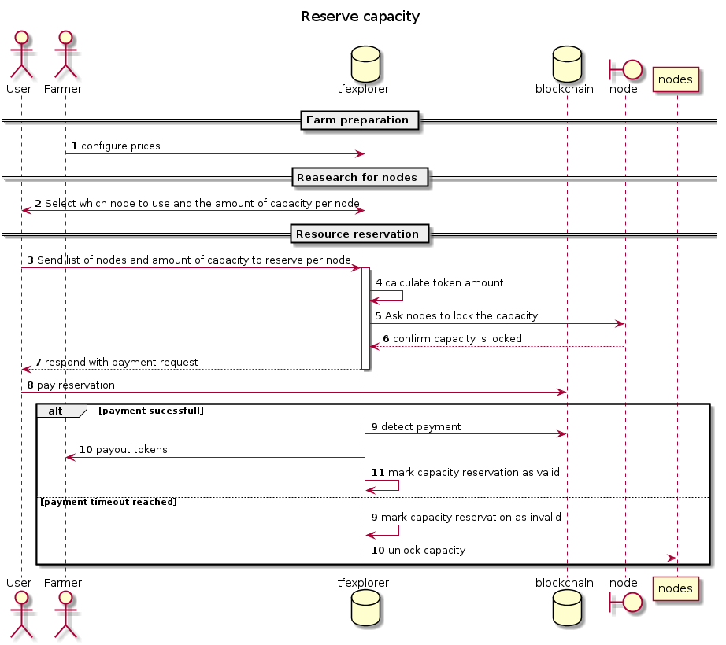
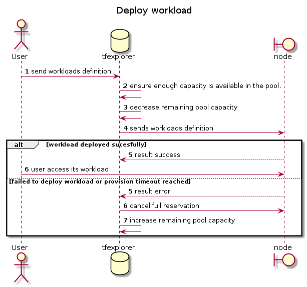

# The problem: update IT contract over time

At the moment, there is no way for a grid user to modify anything in the workloads that are live on the grid. The IT contract is something that is agreed by the user and all involved farmers before.

Once an IT contract is signed by all parties, it is  provisioned by the 3n nodes and the workloads come to life.

If the reservation has been made for a duration of 6 months, there is no way for the user to cancel it after 3 months and not loose the tokens for the last 3 months. A manual discussion between the user and all the farmers  may be be initiated but there is no grantee the farmer will accept to refund the remaining 3 months and this process is impossible to scale.

## Possible solutions

### Decouple the reservation of capacity from the actual workloads description

This solution splits the reservation of capacity from the workloads consuming this capacity.
In order to implement this solution a possible approach would be to create some kind of capacity pool entity. A user would reserve capacity from different farms. Once the capacity is reserved, they could provision/decommission workloads on these farms freely without worrying when deleting a workloads since then the capacity would just be given back to the pool and no tokens would be "lost".

If a user needs to extend the life of its workloads he just has to make sure the reserved capacity from its pools is always funded enough.

Here are the 2 new flows that would need to be implemented:

#### Creation of the capacity pool

This flow is very similar to the current flow to deploy workloads. The main difference is only that the amount of resource units is defined instead of a full workloads definition.

Both the farmer and the user still need to sign the reservation to mark their agreement on the deal. Multi signature is still possible using the same signing request construct that exists today.

The main difference is during the call numbered 3 in the diagram. When the user sends the capacity reservation to the explorer, the explorer will block. During this time, the explorer will send the capacity reservation to the farmer and wait for him to answer (until the farmer 3bot is reality, the explorer takes the role of the farmer and is responsible to make sure the farm has enough capacity to sell).
If enough capacity is available in the farm, the explorer will mark the capacity reservation as to be paid and sends the payment detail to the user.  
If there is not enough free capacity in the farm, the explorer will return an error to the user. The error will include the reason details. The user can then modify it's request and retry.

When the farmer confirms the capacity is locked, the explorer will create aa capacity pool object that defines the amount of capacity reserved by the pool. The pool object also contains the expiration date of the pool. This will be used by the node over time to periodically check back in the explorer and make sure the pool has been extended. If a node has some workloads that are part of a pool that is about to expire, a call is made to the explorer to ask what is the expiration date of the pool. If the pool has not been extended, all the workloads linked to this pool will be decommissioned.

With this system in place, expirations are not needed on the workload definition anymore. It also greatly reduces the amount of time the tokens are locked in the explorer, since as soon as the tokens are received on the escrow account, they can be forwarded directly to the farmer.

If for some reason the client fails to pay the capacity reservation in time, no token transfer is involved at all (unless the client pays only a part of the amount, in which case a refund needs to happen)

#### Workloads deployment

This flow is greatly simplified compared to how it works today. The only party involved are the user, the explorer and the nodes. The farmer and blockchain are no longer involved.

There are still some things to take in to account here. In order to avoid over-provisioning and try to return early, the explorer will keep track of how much resource is available in a capacity pool. So when a workloads definition is received, it first checks if the total amount of resource needed is available in the pool.
This check needs to be atomic in the explorer, meaning that 2 workloads for the same pool need to be processed one at a time.
This is what we see in the step 3 and 4 of the diagram. The modification of the pool capacity is done before the workload definition is sent to the node. This is a protection against concurrent requests trying to deploy workloads using the same capacity pool. By modifying the pool capacity early we prevent over-provisioning.

The pool resource is also updated when a workloads is decommissioned from a node. The explorer does this when it receives a result with the state deleted from a node.

### Todo

- I did not yet measure the impact of those change regarding all the different currency supported. We should try to make sure to avoid the network split generated by the FreeTFT token. cf. https://github.com/threefoldtech/tfexplorer/issues/50
- The exact schema of the different new objects still needs to be defined in detail
- Define clearly all the modification in the code that would be needed for all component to implement this proposal

### Extra ideas

With this design, the capacity reservation is not linked to a single farm but to a list of nodes. This property would allow multiple farmers to create some kind of "virtual farm" where all farmers contribute some capacity and are rewarded based on the % of CPR they allocated to the virtual farm. Think crypto mining pool but for IT capacity. This is especially interesting for very small farmers that have less chance to get market shares. This needs to be further thought out and is not part of this reflection just yet.
