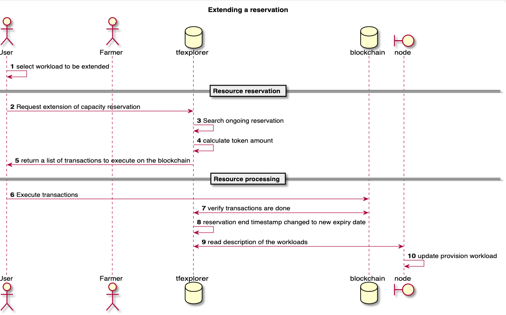

## Allow modification of the IT contract over time

There are 3 different ways that requires an "update/modify" of an IT contract over time, depending on which field of the reservation is modified:

### No change in overall resource unit account of the reservation

This can happen if a bug or a change needs to happen in the flist. 
Only the user(s) need(s) to sign in this case, as from the farmer's point of view, nothing changes. However, it can be that the workload needs to be countersigned by other users. The same quorum applies as with original provisioning of the workload. 

Once agreed the 3Node needs to do the necessary change to make the workloads update. Usually this means a `stop` / `start`  of the workloads. Although depending on the workloads type and the modified field this can be different. Note that it can happen that some workloads would not be possible to update.

### Change in overall resource unit account of the reservation

This change is often combined with the previous one: if a workload requires more capacity, then this workload needs to be reserved additionally, and then this capacity needs to be addressed in the workload. 
A new round of payment needs to happen to cover the new total amount of resource reserved.

### Change of the reservation expiration timestamp

The user wants to extend his reservation without changing anything in the workloads definition. 
Requires new round of payment needs to happen to cover the new total amount of resource reserved. 
To achieve this, a `signing_request_extend` field needs to be filled with valid signatures. 
After signing `signature_extend`is filled with a valid signature. Same rules apply as with provisioning, like the `quorum_min` must be respected to indicate minimum amount of signatures to be respected. 
For this type of change, the reservation.data object doesn't change. 

Proposal is not to allow shortening the reservation time by the user, as this can only be initiated by the sender of the tokens, in this case the farmer. The capacity user does not have the keys to trigger this action. 

The workflow for this change looks like : 

